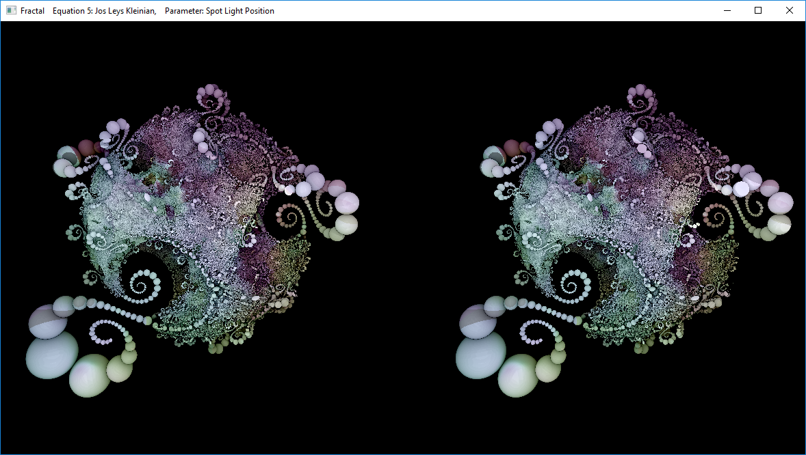
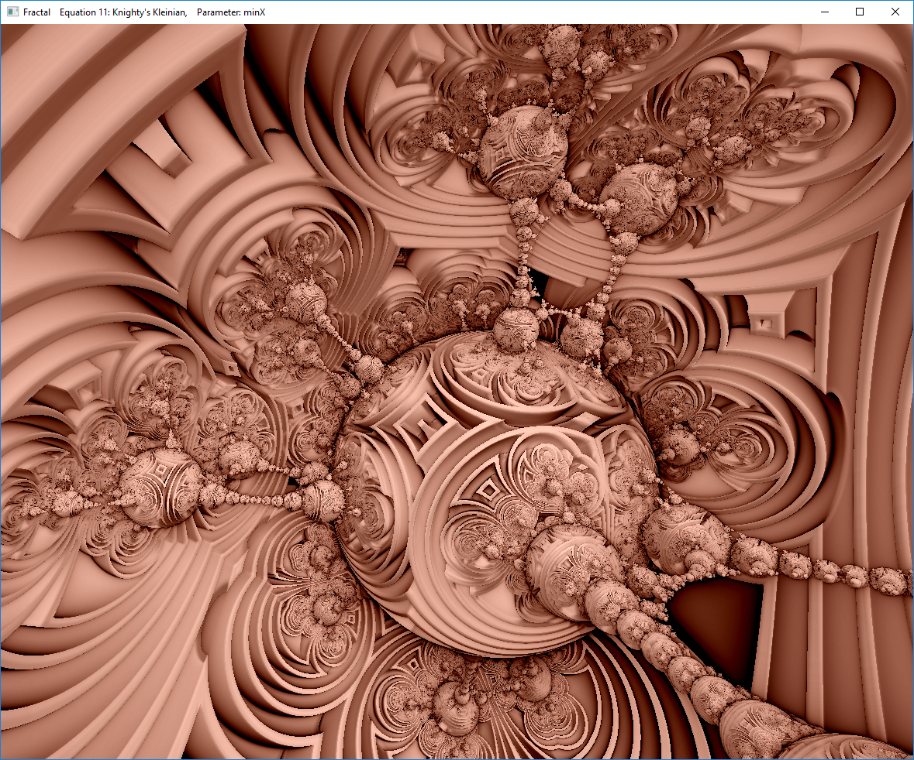

# Fractal2
Ray Marching Fractals for Windows

Ported parts of my OSX_BareBonesRayMarching project to Windows.\
I used VS2019 Community edition.\
Compute shader draws to a texture that is displayed on a textured quad.\

